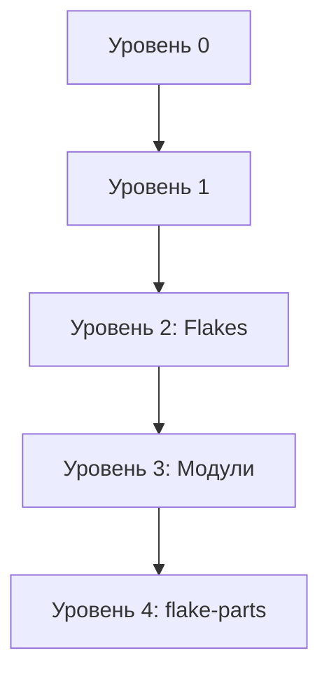
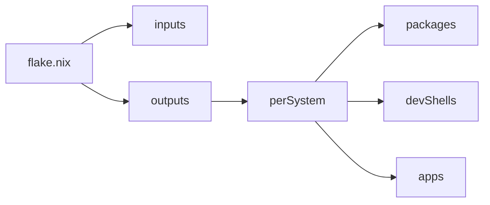

# Структура и устройство тренажёра Nix

## Архитектура проекта

### Иерархия уровней

```
nix-training/
├── README.md              # Главная страница с описанием всех уровней
├── index.yaml             # Конфигурация сайта (генерация статического сайта)
├── AGENTS.md              # Руководство для AI-агентов
├── STRUCTURE.md           # Этот файл — описание архитектуры
└── levels/
    ├── 0/                 # Уровень 0: Введение (демонстрации)
    │   ├── README.md      # Описание уровня
    │   ├── devshell/      # Демо: изолированная среда разработки
    │   ├── process-compose/ # Демо: запуск процессов
    │   └── docker-image/  # Демо: создание Docker-образов
    └── 1/                 # Уровень 1: Основы Nix
        ├── README.md      # Описание уровня
        ├── drv.nix        # Примеры дериваций
        ├── pc.nix         # Пример process-compose без flakes
        ├── nix-build-show.nix # Скрипт для демонстрации store paths
        └── rust/          # Пример Rust-кода для сборки
```

## Как устроен каждый уровень

### Структура уровня

1. **README.md** — текстовое описание концепций
2. **Демо-каталоги** — практические примеры кода
3. **Упражнения** — задания для закрепления (помечены как TODO)

### Формат демонстраций

Каждое демо следует паттерну:
- `flake.nix` — основной файл с конфигурацией
- `README.md` — краткое описание, как запустить

## Текущее состояние

| Уровень | Статус | Темы |
|---------|--------|------|
| 0 | ✅ Готов | Менеджер пакетов, devshell, process-compose, Docker |
| 1 | ✅ Готов | Nix store, деривации, язык, стандартная библиотека |
| 2 | 📋 Запланирован | Flakes, Nixify Rust-проекта |
| 3 | 📋 Запланирован | Система модулей |
| 4 | 📋 Запланирован | flake-parts, монорепозиторий, фронтенд |
| 5 | 📋 Запланирован | Продвинутые темы, свои модули |

---

# Полезные функции для добавления

## 1. Автоматизация и CI/CD

### ✅ Проверка примеров
```nix
# Добавить в каждый flake.nix
checks.default = pkgs.runCommand "test-example" {} ''
  # Тестирование что пример работает
  echo "Test passed" > $out
'';
```

**Где**: В каждом `levels/*/flake.nix`

**Зачем**: Автоматическая проверка что примеры работают после изменений

### 🔄 GitHub Actions / Gitea Actions workflow
```yaml
# .github/workflows/test.yml
name: Test Examples
on: [push, pull_request]
jobs:
  test:
    runs-on: ubuntu-latest
    steps:
      - uses: actions/checkout@v4
      - uses: cachix/install-nix-action@v25
      - run: nix flake check
```

**Где**: Корень репозитория

**Зачем**: CI для всех уровней

### 📦 Кэширование сборок
```nix
# flake.nix
outputs = { self, nixpkgs, ... }: {
  cachix = {
    name = "nix-training";
    signingKey = "cachix-1:...";
  };
};
```

**Где**: Корневой `flake.nix` (если будет)

**Зачем**: Ускорение сборок для учащихся

---

## 2. Интерактивность и упражнения

### ✅ Упражнения с проверкой
```nix
# levels/1/exercise.nix
let
  pkgs = import <nixpkgs> {};
in
pkgs.runCommand "exercise-check" {} ''
  # Проверка решения упражнения
  if [ -f solution.nix ]; then
    nix-build solution.nix && echo "✓ Exercise passed" > $out
  else
    echo "✗ Solution not found" && exit 1
  fi
''
```

**Где**: `levels/*/exercise.nix`

**Зачем**: Автоматическая проверка решений

### 📝 Шаблоны для упражнений
```
levels/
└── 1/
    └── exercises/
        ├── derivation-template.nix  # Шаблон
        ├── solution.nix.example     # Пример решения
        └── README.md                # Инструкция
```

**Где**: Новый каталог `exercises/` в каждом уровне

**Зачем**: Структурированные задания

### 🎯 Интерактивные тесты
```nix
# Использовать pkgs.runCommand для создания тестов
testScript = ''
  # Проверка что devShell содержит нужные пакеты
  test -x $(which cowsay) || exit 1
  # Проверка что приложение запускается
  foo | grep -q "Moo" || exit 1
'';
```

**Где**: В `flake.nix` каждого демо

**Зачем**: Быстрая обратная связь

---

## 3. Навигация и документация

### 🔗 Перекрёстные ссылки
```markdown
<!-- В README.md -->
См. [демо devshell](./devshell/README.md)

<!-- Или использовать существующий синтаксис -->
![[devshell/flake.nix]]
```

**Где**: Все README файлы

**Зачем**: Удобная навигация

### 📑 Глоссарий терминов
```markdown
# GLOSSARY.md

## Деривация
Функция или рецепт для создания пути в хранилище...

## Flake
Самодостаточная единица конфигурации Nix...
```

**Где**: Корень репозитория

**Зачем**: Быстрый справочник терминов

### 🗺️ Карта зависимостей
```markdown
# DEPENDENCIES.md

Уровень 0 → требует: базовый Nix
Уровень 1 → требует: Уровень 0
Уровень 2 → требует: Уровень 1, понимание flakes
...
```

**Где**: Корень репозитория

**Зачем**: Понимание последовательности изучения

---

## 4. Утилиты и скрипты

### 🚀 Скрипт запуска всех демо
```bash
#!/usr/bin/env bash
# scripts/run-all-demos.sh
set -e

for level in levels/*/; do
  echo "=== Уровень: $level ==="
  cd "$level"
  
  for demo in */; do
    if [ -f "$demo/flake.nix" ]; then
      echo "→ Запуск: $demo"
      cd "$demo" && nix run && cd ..
    fi
  done
  
  cd ..
done
```

**Где**: `scripts/run-all-demos.sh`

**Зачем**: Быстрый запуск всех примеров

### 🧹 Скрипт очистки
```bash
#!/usr/bin/env bash
# scripts/cleanup.sh
nix-collect-garbage -d
rm -rf result result-*
```

**Где**: `scripts/cleanup.sh`

**Зачем**: Очистка после упражнений

### 📊 Скрипт статистики
```bash
#!/usr/bin/env bash
# scripts/stats.sh
echo "Уровни: $(ls -d levels/*/ | wc -l)"
echo "Демо: $(find levels -name flake.nix | wc -l)"
echo "Файлы .nix: $(find levels -name '*.nix' | wc -l)"
```

**Где**: `scripts/stats.sh`

**Зачем**: Обзор прогресса

---

## 5. Визуализация и диаграммы

### 📈 Диаграммы зависимостей


**Где**: В `README.md` или отдельный `ARCHITECTURE.md`

**Зачем**: Визуальное понимание структуры

### 🏗️ Архитектурные диаграммы


**Где**: В документации к каждому уровню

**Зачем**: Понимание структуры flake

---

## 6. Расширенные демо

### 🐳 Docker Compose интеграция
```nix
# levels/2/docker-compose/flake.nix
packages.default = pkgs.dockerTools.buildImage {
  name = "app-with-compose";
  copyToRoot = [
    pkgs.docker-compose
    # ...
  ];
  config = {
    Cmd = [ "docker-compose" "up" ];
  };
};
```

**Где**: Новый каталог в уровне 2 или 4

**Зачем**: Реальные сценарии развёртывания

### 🔄 CI/CD пайплайны
```nix
# levels/4/ci-demo/flake.nix
packages.ci-pipeline = pkgs.writeShellScript "ci-pipeline" ''
  nix flake check
  nix build
  nix run .#test
'';
```

**Где**: Уровень 4 или 5

**Зачем**: Демонстрация production use cases

### 🌐 Веб-сервер демо
```nix
# levels/3/web-server/flake.nix
apps.server.program = pkgs.writeShellApplication {
  name = "web-server";
  runtimeInputs = [ pkgs.python3 pkgs.flask ];
  text = ''
    python3 -m http.server 8000
  '';
};
```

**Где**: Уровень 3 или 4

**Зачем**: Практический пример

---

## 7. Локализация и доступность

### 🌍 Многоязычная поддержка
```
docs/
├── ru/     # Русская версия
├── en/     # Английская версия
└── ...     # Другие языки
```

**Где**: Отдельный каталог `docs/` или дублирование README

**Зачем**: Доступность для международной аудитории

### ♿ Accessibility проверки
```bash
# scripts/check-accessibility.sh
# Проверка читаемости документации
# Проверка контрастности (если есть веб-версия)
```

**Где**: `scripts/`

**Зачем**: Инклюзивность

---

## 8. Интеграция с инструментами

### 🔍 LSP конфигурация
```json
// .vscode/settings.json
{
  "nix.serverPath": "nil",
  "nix.formatting.command": ["nixfmt"]
}
```

**Где**: `.vscode/settings.json`, `.vim/coc-settings.json`

**Зачем**: Поддержка редакторов

### 📝 Pre-commit хуки
```yaml
# .pre-commit-config.yaml
repos:
  - repo: https://github.com/nix-community/nixpkgs-fmt
    rev: v1.3.0
    hooks:
      - id: nixpkgs-fmt
```

**Где**: Корень репозитория

**Зачем**: Автоматическое форматирование

### 🧪 Flake check расширения
```nix
# В каждый flake.nix добавить
checks = {
  formatting = pkgs.runCommand "check-format" {} ''
    nixfmt --check ${./flake.nix} && touch $out
  '';
  
  lint = pkgs.runCommand "check-lint" {} ''
    statix check --quiet && touch $out
  '';
};
```

**Где**: Все `flake.nix` файлы

**Зачем**: Контроль качества кода

---

## 9. Метрики и аналитика

### 📊 Трекинг прогресса
```markdown
# PROGRESS.md

## Уровень 0
- [x] Менеджер пакетов
- [x] Devshell
- [x] Process-compose
- [x] Docker

## Уровень 1
- [x] Nix store
- [x] Деривации
- [ ] Упражнение: pc.nix
```

**Где**: `PROGRESS.md` в корне

**Зачем**: Отслеживание завершения

### 📈 Сбор статистики использования
```bash
# scripts/usage-stats.sh (опционально, с согласия пользователя)
# Какие демо запускаются чаще
# Какие упражнения выполняются
```

**Где**: `scripts/`

**Зачем**: Улучшение тренажёра на основе данных

---

## 10. Сообщество и обратная связь

### 💬 Система комментариев/обсуждений
```markdown
<!-- В конце каждого README -->

## Обсуждение

Есть вопросы? Откройте [issue](https://github.com/.../issues)
```

**Где**: Все README файлы

**Зачем**: Обратная связь от учащихся

### 🤝 Contributing guide
```markdown
# CONTRIBUTING.md

## Как добавить новый уровень
1. Создайте каталог levels/N/
2. Добавьте README.md с описанием
3. Добавьте демо с flake.nix
4. Добавьте упражнения
5. Обновите главный README.md
```

**Где**: `CONTRIBUTING.md` в корне

**Зачем**: Привлечение контрибьюторов

### 📝 Changelog
```markdown
# CHANGELOG.md

## [0.2.0] - 2026-06-25
### Добавлено
- Уровень 1: Основы Nix
- Упражнения для уровня 1

### Изменено
- Перевод на русский язык
```

**Где**: `CHANGELOG.md` в корне

**Зачем**: История изменений

---

## Приоритеты внедрения

### 🔴 Высокий приоритет (сделать сейчас)
1. ✅ Упражнения с проверкой — без практики обучение неэффективно
2. ✅ CI/CD для проверки примеров — гарантия работоспособности
3. ✅ Глоссарий терминов — помощь новичкам

### 🟡 Средний приоритет (следующий спринт)
4. Pre-commit хуки и форматирование
5. Скрипты автоматизации (run-all, cleanup)
6. Диаграммы и визуализация

### 🟢 Низкий приоритет (когда будет время)
7. Многоязычная поддержка
8. Метрики и аналитика
9. Расширенные демо (Docker Compose, CI/CD пайплайны)

---

## Roadmap

### Фаза 1: Завершение основ (Уровни 0-2)
- [ ] Добавить упражнения к уровню 0
- [ ] Добавить упражнения к уровню 1
- [ ] Завершить уровень 2 (Flakes)
- [ ] Добавить CI проверку

### Фаза 2: Модульная система (Уровни 3-4)
- [ ] Уровень 3: Система модулей
- [ ] Уровень 4: flake-parts + монорепозиторий
- [ ] Интеграция фронтенда

### Фаза 3: Продвинутые темы (Уровень 5)
- [ ] Написание собственных модулей
- [ ] Production паттерны
- [ ] Оптимизация сборок

### Фаза 4: Полировка
- [ ] Документация и глоссарий
- [ ] Визуализация и диаграммы
- [ ] Сообщество и contributing guide
